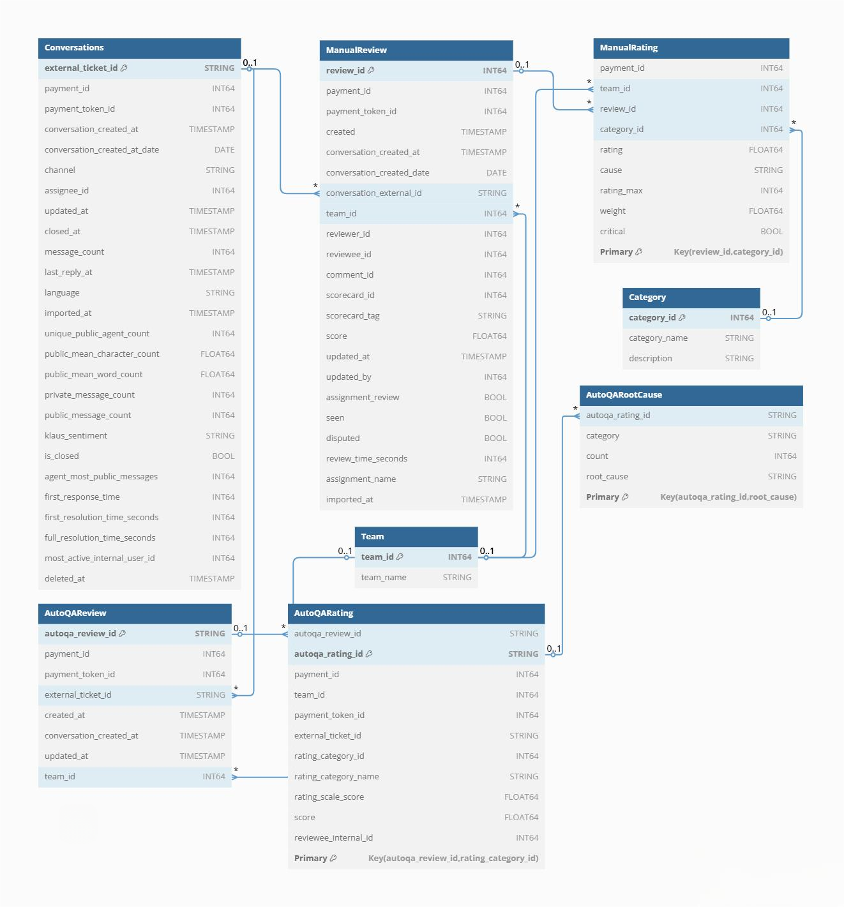

# Klaus BigQuery Data Ingestion using Python

# **Part A: Solution Documentation**

This is my overview of the solution implemented for Part A of the assignment. It includes details about the data model, SQL tasks, and the overall approach taken to design and implement the solution.

---

## **1. Data Model**

### **1.1 Entities**
The following entities were identified based on the data provided:

1. **Conversations**: Represents customer interactions.
2. **ManualReview**: Stores human-evaluated reviews.
3. **ManualRating**: Contains category-specific ratings for manual reviews.
4. **AutoQAReview**: Stores automated QA reviews.
5. **AutoQARating**: Contains category-specific ratings for automated QA reviews.
6. **AutoQARootCause**: Provides root cause explanations for issues detected in automated ratings.
7. **Team**: Represents organizational or agent groups.
8. **Category**: Standardizes evaluation categories across manual and automated ratings.

### **1.2 Relationships**
- **Conversations** are reviewed in **ManualReview** and **AutoQAReview**.
- **ManualReview** and **AutoQAReview** are linked to **ManualRating** and **AutoQARating**, respectively, to store category-specific ratings.
- **AutoQARootCause** is linked to **AutoQARating** to provide explanations for issues.
- **Team** is associated with **ManualReview** and **AutoQAReview** to identify the team responsible for the review.
- **Category** is referenced by **ManualRating** and **AutoQARating** to classify ratings by category.

### **1.3 Data Types**
- **STRING**: Used for unique identifiers and textual data.
- **INT64**: Used for numeric values like counts and ratings.
- **FLOAT64**: Used for scores and weighted values.
- **TIMESTAMP**: Used for date and time fields.

### **1.4 Entity-Relationship Diagram (ERD)**




---

## **3. Assumptions**

### **Team Table**
- The `team_id` field is assumed to uniquely identify a team.
- Default team names were generated as "Team <team_id>" when no additional metadata was available.
- The Team table is populated using distinct `team_id` values from both `ManualReview` and `AutoQAReview` tables.

### **Category Table**
- Categories were inferred from both `ManualRating` and `AutoQARating` tables.
- If a valid category name was available in `AutoQARating`, it was prioritized; otherwise, a default name like "Category <category_id>" was used.
- The Category table ensures that all categories across manual and automated ratings are standardized.

### **Numeric Fields**
- Numeric fields with missing or invalid values were coerced into nullable integers (`INT64`) or floats (`FLOAT64`) using pandas.
- Fields such as `rating_max`, `weight`, and `score` were assumed to be numeric, with invalid entries treated as `NULL`.
- Fields like `message_count`, `unique_public_agent_count`, and `first_response_time_seconds` were also treated as numeric with nullable integer types.

### **String Fields**
- String fields (e.g., `external_ticket_id`, `rating_category_name`) were explicitly converted to strings during preprocessing.
- Missing string values were replaced with empty strings (`''`) to ensure consistency during ingestion.
- Identifiers like `autoqa_review_id` and `reviewee_internal_id` were treated as strings to avoid potential issues with leading zeros or non-numeric characters.

---

## **3. SQL Tasks**

### **Task 1: Rating Score Algorithm**
Come up with a rating score algorithm that accounts for rating category weights (available in `manual_rating_test.csv` table). Note on rating - (42 represens N/A). Score should be representable in percentages from 0 to 100.

```sql
SELECT 
  review_id,
  ROUND(
    100 * SUM(
      CASE 
        WHEN rating = 42 THEN 0 
        ELSE (rating / rating_max) * weight 
      END
    ) /
    NULLIF(SUM(
      CASE 
        WHEN rating = 42 THEN 0 
        ELSE weight 
      END
    ), 0), 2) AS weighted_score_percentage
FROM `klaus-data-model.klaus_dataset.ManualRating`
GROUP BY review_id;

```

### **Task 2: Ticket Average Score**
Calculate the average score for each ticket in `autoqa_ratings_test.csv`.

```sql
SELECT 
SELECT 
  external_ticket_id, 
  ROUND(AVG(score), 2) AS average_score
FROM `klaus-data-model.klaus_dataset.AutoQARating`
GROUP BY external_ticket_id;
```

### **Task 3: Reviewee Average Score**
Calculate the average review score for each reviewee in `manual_reviews_test.csv` table if the reviewee has two or more reviews.

```sql
SELECT 
  reviewee_id,
  ROUND(AVG(score),2) AS average_review_score,
  COUNT(*) AS review_count
FROM `klaus-data-model.klaus_dataset.ManualReview`
GROUP BY reviewee_id
HAVING COUNT(*) >= 2;
```

---
